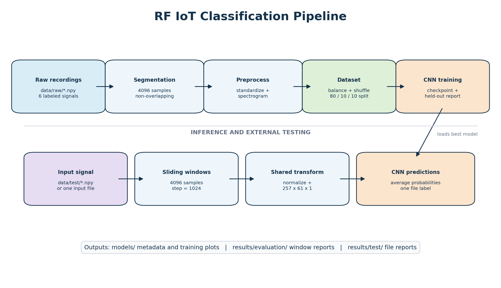
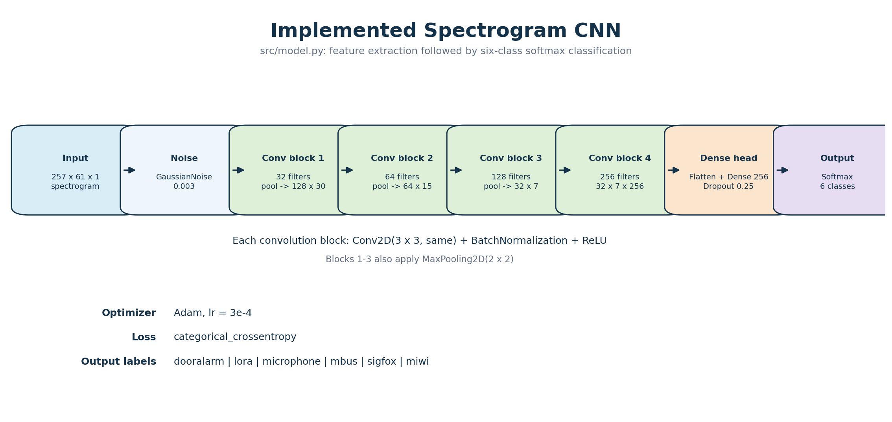

# Documentation

This documentation describes the implemented RF IoT classification project as
reviewed from the source code and checked-in result artifacts on 2026-05-25.

## Contents

| Document | Purpose |
| --- | --- |
| [architecture.md](architecture.md) | System components, data flow, CNN architecture, and generated diagrams |
| [methodology.md](methodology.md) | Dataset treatment, preprocessing, training, evaluation, and result interpretation |
| [code_review.md](code_review.md) | Review findings, risks, and recommended remediation |
| [presentation_outline.md](presentation_outline.md) | Presentation structure grounded in the implementation and recorded outputs |

## Generated Diagrams





The PNG assets are generated by `docs/generate_diagrams.py`:

```bash
python docs/generate_diagrams.py
```

The generator encodes only documentation graphics; application execution does
not depend on it.
